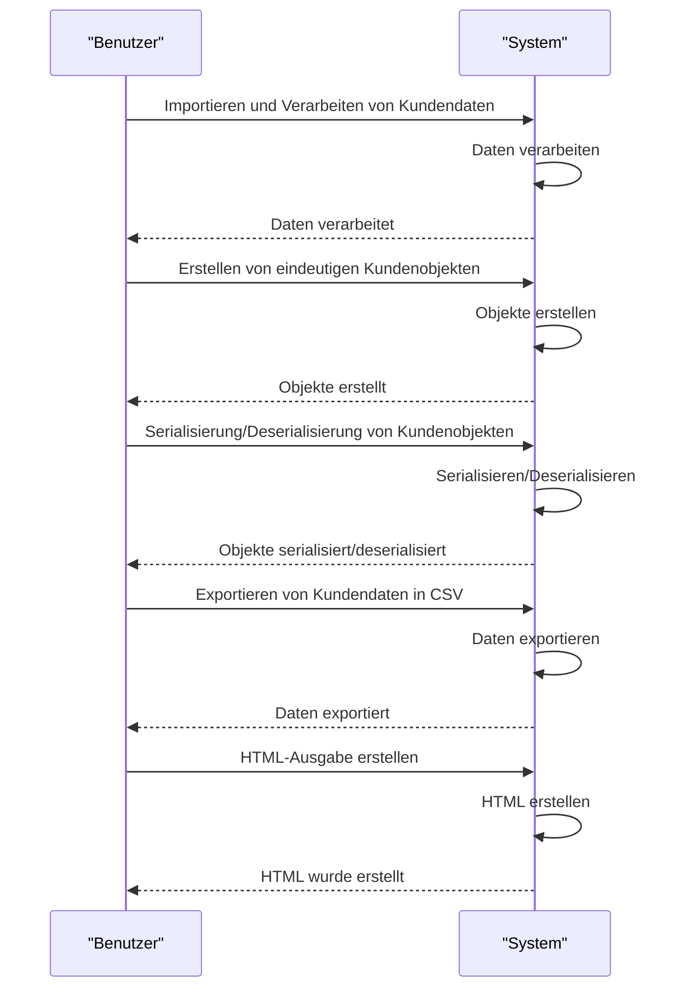
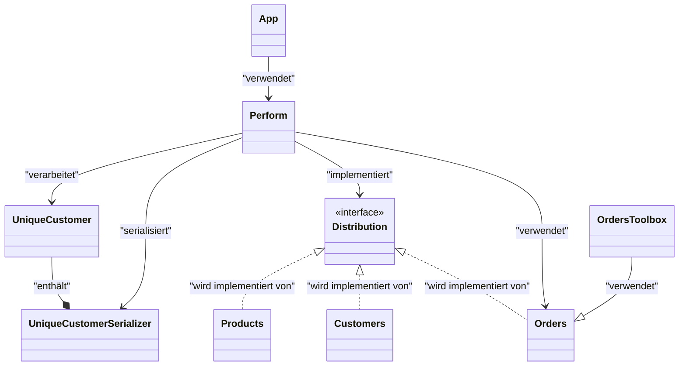
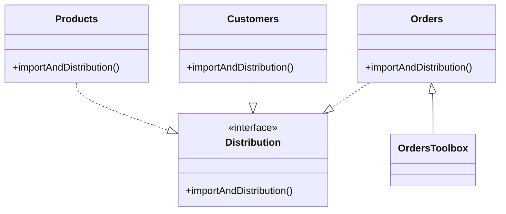
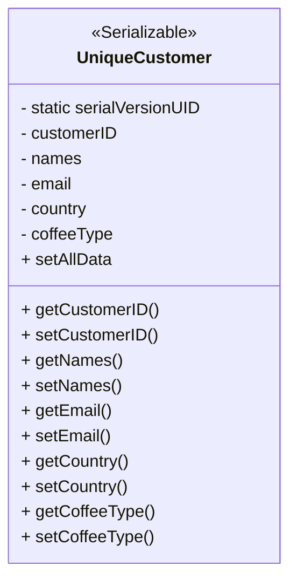
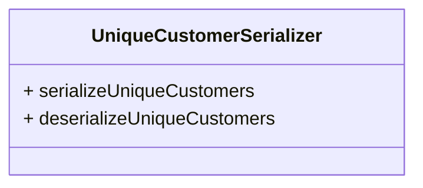
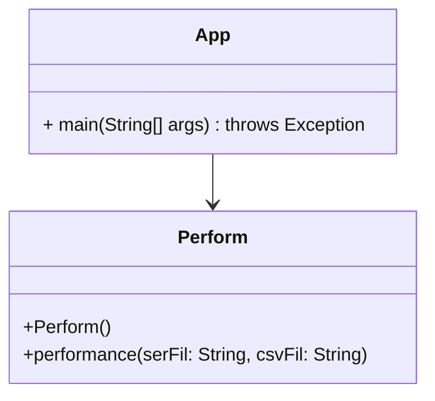
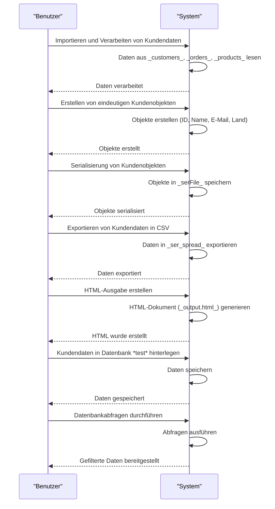
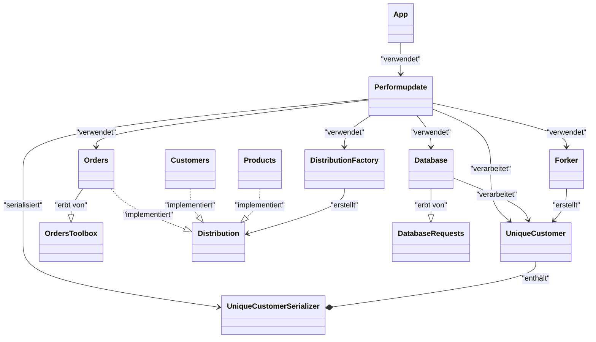

# Readme

## Inhalt

|  |  |
|--|--|
| [Ansatz](#ansatz) | [Hintergrund](#hintergrund) |
| [Klassendiagramm](#klassendiagramm) | [Datengewinnung](#datengewinnung) |
| [Serialisierungsprozess](#serialisierungsprozess) | [Ausgabe](#ausgabe) |
| [Update](#update) |[Tests](#tests)|

---

## Ansatz
Data Scraping ist eine Technik, bei der ein Computerprogramm Daten aus der von Menschen lesbaren Ausgabe eines anderen Programms extrahiert.

Updates werden implementiert, die den Fortschritt des Projekts dokumentieren. In der Inhaltsübersicht sind diese entsprechend aufgeführt.

Folgende Use Cases werden abgearbeitet: 

**Usecase1 - Importieren und Verarbeiten von Kundendaten:**
Der Code liest Daten aus verschiedenen Tabellenblättern (*customers*,*orders*,*products*) und ordnet die relevanten Informationen zu. Dies ermöglicht die weitere Verarbeitung und Analyse von Kundendaten.

**Usecase2 - Erstellen von eindeutigen Kundenobjekten:**

Es wird eine Liste von Kunden-Objekten erstellt. Jedes Kunden-Objekt stellt einen eindeutigen Kunden dar und enthält Informationen wie Kunden-ID, Name, E-Mail und Land.

**Usecase3 - Serialisierung und Deserialisierung von Kundenobjekten:**

Die Kunden-Objekte werden in einer Datei (*serFile*) hinterlergt.

**Usecase4 - Exportieren von Kundendaten in eine CSV-Datei:**
Die Kundendaten werden in eine CSV-Datei(*ser_spread*) geschrieben. Jede Zeile enthält die Angaben zu einem Kunden. Dadurch können die Daten in Tabellenkalkulationsprogramme importiert oder weiter analysiert werden.

**Usecase5 - HTML-Ausgabe generieren:**
 Im Rahmen des generierten HTML-Dokuments (*output.html*) werden die Kundeninformationen in tabellarischer Form angezeigt. 

Sequenzdiagramm für die Use-Cases:

---

## Hintergrund

Das Scraping von Sheets ist aus mehreren Gründen wichtig.
Zum einen lassen sich große Datenmengen schnell erfassen, zum anderen lassen sich diese Daten dann mit Analysetools nutzen, um Erkenntnisse zu gewinnen. 
Darüber hinaus werden unstrukturierte Dateien in strukturierte Formate umgewandelt, wodurch sich Marktdaten, Preise von Mitbewerbern und andere wertvolle Informationen sammeln lassen, die für die Vorbereitung strategischer Entscheidungen von Nutzen sind.

---

## Klassendiagramm
Im Folgenden wird das vollständige Klassendiagramm präsentiert, welches im Rahmen des vorliegenden Projekts zum Einsatz kommt:

---

## Datengewinnung

Für die *generelle* Datengewinnung sind die Klassen *Customers, Orders, Products* und das Interface *Distribution* verantwortlich. Diese Klassen verfügen über die Methode *importAndDistribution()*.
Diese Methode ermöglicht den Import und die Verteilung der Daten mit Hilfe einer HashMap. Der Code liest CSV-Dateien zeilenweise ein und speichert die Daten in einer HashMap, wobei jeder Schlüssel ein Spaltenname und der Wert eine Liste der entsprechenden Daten ist. Die Methode ist mit *@override* gekennzeichnet, so dass das Interface *Distribution* darauf Zugriff hat. 

    
Klassendiagramm:
 

Für die *spezielle* Datengewinnung sind die Methoden in *OrdersToolbox* verantwortlich. Sie gleichen jeweils die ermittelten Daten der Klassen *Customers, Products und Orders* ab und haben die sprechenden Namen: *getMatchingCustomerName, getMatchingEmail, getMatchingCountry,  getMatchingCoffeeTypes*. 

---

## Serialisierungsprozess

Für den Serialisierungsprozess sind die Klassen *UniqueCustomer* und *UniqueCustomerSerializer* verantwortlich.
Mit *UniqueCustomer* können eindeutige Kunden-Objekte erstellt werden.
Jedes Kunden-Objekt stellt einen eindeutigen Kunden dar und enthält Informationen wie Kunden-ID, Name, E-Mail und Land.

Klassendiagramm *UniqueCustomer*: 

Der *UniqueCustomerSerializer* bietet die Möglichkeit, die Kundenobjekte in einer Datei (serFile) abzulegen, sodass sie zu einem späteren Zeitpunkt in einer CSV-Datei oder einem HTML-Dokument hinterlegt werden können. 

Klassendiagramm *UniqueCustomerSerializer*: 

---
## Ausgabe

Für das Generieren der CSV und HTML-Datei ist die  Klasse *Perform* zuständig. Ausgeführt wird eine Instanz von *Perform* in *App*.

Zuvor arbeitet die Methode *performance* folgende Schritte ab:

 1. Der Code importiert die erforderlichen Rohdaten mit der Methode *importAndDistribution()* des Interface *Distribution*. 
 2. Nun werden den Variablen Informationen aus den importierten Daten zugewiesen und in extra Listen gespeichert. So werden Kunden-IDs, Kundennamen, E-Mail-Adressen, Länder und Kaffeearten extrahiert.
 3. Für jeden Kunden wird ein eigenes *UniqueCustomer*-Objekt erstellt. Diese Objekte werden in einer Liste gespeichert.
 4. Das Programm verwendet die Klasse *UniqueCustomerSerializer*, um die Liste zu serialisieren.
 
 Für die CSV-Ausgabe wird
 
 5. ein *PrintWriter*-Objekt erstellt, um Daten in eine CSV-Datei zu schreiben, die über die Variable *csvFile* angegeben wird.
 6. die *UniqueCustomer*-Objekte werden durchlaufen, die durch die Datei *serFile* gewonnen wurden.
 7. Für jedes *UniqueCustomer*-Objekt werden Name, E-Mail, Land und Kaffeetyp auf der Konsole ausgegeben.
 8. Die Informationen werden mit der Methode *writer.println()* in die CSV-Datei geschrieben. 
 9. Zum Schluss wird "*Ready."* auf der Konsole angezeigt.
 
 Für die HTML-Ausgbabe wird
 
 10. ein weiteres *PrintWriter*-Objekt erstellt, um die Daten in eine HTML-Datei zu schreiben.
 11. Dann werden die HTML-Tags geschrieben.
 12. Jetzt wird eine HTML-Tabelle erstellt.
 13. Die Daten der *UniqueCustomer*-Objekte werden wie bei der CSV-Ausgabe durchlaufen und für jeden Kunden eine neue Zeile mit seinen Daten hinzugefügt.
 14. Wenn die Tabelle fertig ist, werden die HTML-Tags geschlossen.
 15.  Zum Schluss wird "*HTML document generated successfully"* auf der Konsole angezeigt.

Klassendiagramm *Perform* und *App*: 

---
## Update

#### Allgemein
Das Update, alle nötigen Dateien befinden sich in dem Ordner *Performanceverbesserung*, behebt mehrere zentrale Probleme der vorherigen Implementierung: Modularität, Effizienz, Flexibilität, Benutzerfreundlichkeit, Hinterlegen der Daten in einer Datenbank.

Folgende UseCases werden abgearbeitet:

**Usecase1 - Importieren und Verarbeiten von Kundendaten:**  Der Code liest Daten aus verschiedenen Tabellenblättern (_customers_,_orders_,_products_) und ordnet die relevanten Informationen zu. Dies ermöglicht die weitere Verarbeitung und Analyse von Kundendaten.

**Usecase2 - Erstellen von eindeutigen Kundenobjekten:**

Es wird eine Liste von Kunden-Objekten erstellt. Jedes Kunden-Objekt stellt einen eindeutigen Kunden dar und enthält Informationen wie Kunden-ID, Name, E-Mail und Land.

**Usecase3 - Serialisierung und Deserialisierung von Kundenobjekten:**

Die Kunden-Objekte werden in einer Datei (_serFile_) hinterlergt.

**Usecase4 - Exportieren von Kundendaten in eine CSV-Datei:**  Die Kundendaten werden in eine CSV-Datei(_ser_spread_) geschrieben. Jede Zeile enthält die Angaben zu einem Kunden. Dadurch können die Daten in Tabellenkalkulationsprogramme importiert oder weiter analysiert werden.

**Usecase5 - HTML-Ausgabe generieren:**  Im Rahmen des generierten HTML-Dokuments (_output_verbesserung.html_) werden die Kundeninformationen in tabellarischer Form angezeigt.

**Usecase6 - Hinterlegen der Daten in einer Datenbank:**  Die Kundendaten werden in einer Datenbank mit Namen *test* hinterlegt.

**Usecase7 - Datenbankabfragen**  Das bessere Filtern ist nun möglich. 

Sequenzdiagramm für die Use-Cases:

Das aktuelle Klassendiagramm sieht wie folgt aus:

---

#### Klasse Peformupdate
Die grundlegenden Aufgaben der Datenverarbeitung bleiben unverändert, während die Implementierung des Factory-Entwurfsmusters und die Parallelverarbeitung die Verarbeitungsgeschwindigkeit verbessern.

Die Veränderungen im einzelnen:

- **Modularisierung und Lesbarkeit**
- -  **Methodenstruktur**: Die neue Klasse `Performupdate` verwendet eine klarere Trennung von Verantwortlichkeiten durch die Einführung spezifischer Methoden wie `importSheets`, `createUniqueCustomers` und `outputToFiles`. Dies verbessert die Lesbarkeit und Wartbarkeit des Codes, da jede Methode eine spezifische Aufgabe hat, im Gegensatz zur monolithischen Struktur der `performance`-Methode in der Klasse `Perform`.

- **Verwendung von Factory-Methoden**
- - **DistributionFactory**: Anstelle von direkten Instanziierungen der `Distribution`-Klassen in `Perform`, nutzt `Performupdate` ein Factory-Entwurfsmuster (`DistributionFactory.getDistribution`).  Neue Distribution-Typen können hinzugefügt werden, ohne `Performupdate` zu ändern. Die zentrale Verwaltung in der Factory erhöht die Wartbarkeit und ermöglicht flexible Objekterstellung zur Laufzeit. Zudem reduziert es Abhängigkeiten und bereitet das System auf zukünftige Änderungen vor.

- **Parallelverarbeitung**
- - **ForkJoinPool**: In der ursprünglichen `performance`-Methode wurde die Datenverarbeitung sequentiell durchgeführt. Jede Aufgabe wurde nacheinander ausgeführt, was eine Zeitkomplexität von *O(n)* für jede Schleife ergab. Mit dem Fork/Join-Framework wird die Verarbeitung in kleinere Aufgaben unterteilt, die parallel ausgeführt werden. Bei *n* Elementen und *p* Threads wird sich die Laufzeit auf *O(n/p)* verringern, wobei p die Anzahl der verfügbaren Prozessoren ist. Die Parallelisierung verbessert die Leistung, insbesondere bei steigenden Datenmengen, und erhöht die Verarbeitungsgeschwindigkeit.

- **Verbesserte Fehlerbehandlung**
- - **Konsistente Fehlerausgaben**: Die Struktur in `Performupdate` ist klarer und konzentriert sich auf spezifische Aufgaben, was die Nachverfolgbarkeit von Fehlern erleichtert.

- **Datenbankintegration**
- - **Datenbankoperationen**: Datenbankoperationen sind direkt im Workflow integriert. Eine Datenbankinstanz speichert Kundeninformationen und führt Abfragen durch. Dadurch werden alle Daten zentral verwaltet und die Interoperabilität mit anderen Systemen verbessert.

- **Verbesserte Ausgabeformate**
- -  **HTML-Ausgabe**: Die HTML-Ausgabe in `Performupdate` hat ein verbessertes Design. E-Mail-Adressen, die nicht verfügbar sind, werden rot angezeigt.

- **Flexibilität und Erweiterbarkeit**
- - **Erweiterte Parameterübergabe**: Die Methode `performance` in der neuen Klasse akzeptiert ein zusätzliches Argument vom Typ `Database`, was es ermöglicht, unterschiedliche Datenbankimplementierungen zu verwenden.

---

#### Klasse Database

Die Klasse `Database` implementiert eine Datenbankverwaltung für die Kundeninformationen. Sie verwendet den H2-Datenbanktreiber (`org.h2.Driver`), um eine Verbindung zu einer lokalen H2-Datenbank unter dem Pfad `~/data/test` herzustellen.

Im Einzelnen:
- **Architektur**
- - Die Klasse `Database` ist so aufgebaut, dass sie eine Verbindung zur H2-Datenbank herstellt und eine Tabelle für die Speicherung von Kundeninformationen erstellt. 

- **Verwaltungsstruktur**

 | Spalte | Datentyp | Beschreibung |
|-------------|------------------|--------------------------------------------------|
  | id | INT | Primärschlüssel, automatisch inkrementiert |
   | customerID | VARCHAR(50) | ID des Kunden |
   | name | VARCHAR(100) | Name des Kunden | 
   | email | VARCHAR(100) | E-Mail-Adresse des Kunden |
   | country | VARCHAR(50) | Land des Kunden | 
   | coffeeType | VARCHAR(5) | Typ des Kaffees |

- **CRUD**

| Operation | Methode | Beschreibung |
 |-----------------|-------------------------------------------------|-------------------------------------------------------------------------------------------------------|
  | Create | createTable() | Erstellt die Tabelle, wenn sie nicht bereits existiert. | 
  | Read | queryData() | Ruft alle Datensätze aus der Tabelle ab und zeigt sie in der Konsole an. | 
  | Update | insertCustomers(List<UniqueCustomer> customers) | Fügt mehrere Kunden in die Tabelle ein, um SQL-Injection zu vermeiden. |
   | Update | updateCustomer(int id, UniqueCustomer updatedCustomer) | Aktualisiert bestehende Kundeninformationen anhand ihrer ID. | 
   | Delete | deleteDatabase() | Datenbank wird gelöscht. |

---
#### Klasse Forker

Die Klasse `Forker` ermöglicht die parallele Verarbeitung von Kundendaten unter Verwendung des Fork/Join-Frameworks in Java. Das Framework basiert auf der *Divide-and-Conquer-Strategie*. Hierbei wird eine Aufgabe in kleinere, handhabbare Teile zerlegt (Forking), die parallel ausgeführt werden, und anschließend werden die Ergebnisse zusammengeführt (Joining)

Die Klasse akzeptiert verschiedene Listen als Parameter, die Informationen zu Bestellungen, Namen, E-Mails, Ländern und Kaffeesorten enthalten. Zusätzlich wird eine Liste von `UniqueCustomer`-Objekten bereitgestellt, in der die verarbeiteten Kundendaten gespeichert werden.

In der Methode `compute()` wird rekursiv entschieden, ob eine weitere Unterteilung der Daten erforderlich ist. Sind die Listen mit den Kundendaten kleiner oder gleich einer festgelegten Größe (THRESHOLD), erfolgt die Bearbeitung sequentiell. Für jeden Kunden wird ein `UniqueCustomer`-Objekt erstellt und der Ergebnisliste hinzugefügt. Bei größeren Listen erfolgt eine Teilung in zwei Hälften. Für jede Hälfte wird ein neuer Forker-Task initiiert, der die Daten weiter aufteilt und parallel bearbeitet.

---
## Tests
Im Ordner *Tests* sind für jede eingesetzte Klasse entsprechende JUnit-Tests hinterlegt. 
