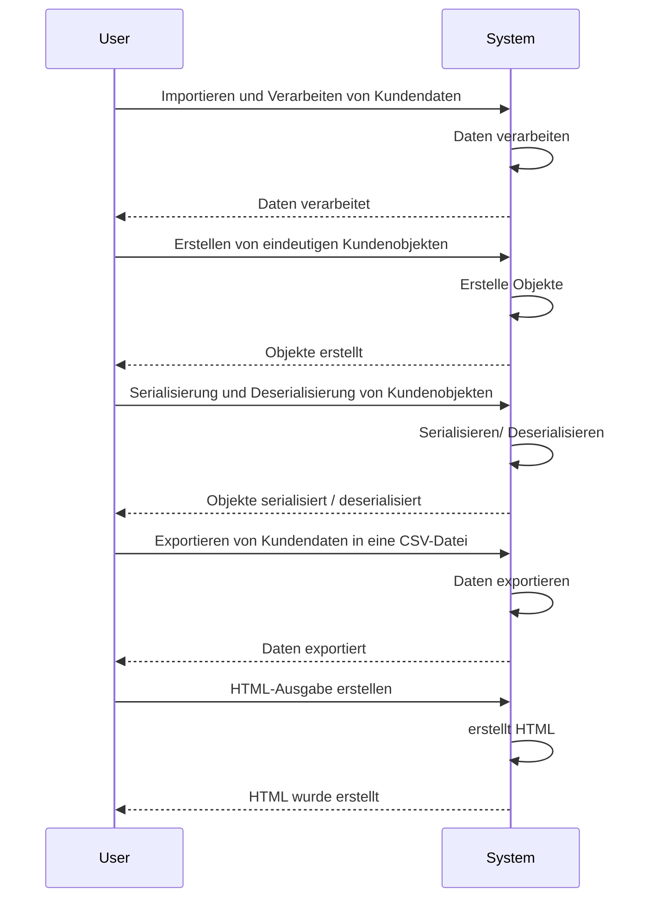
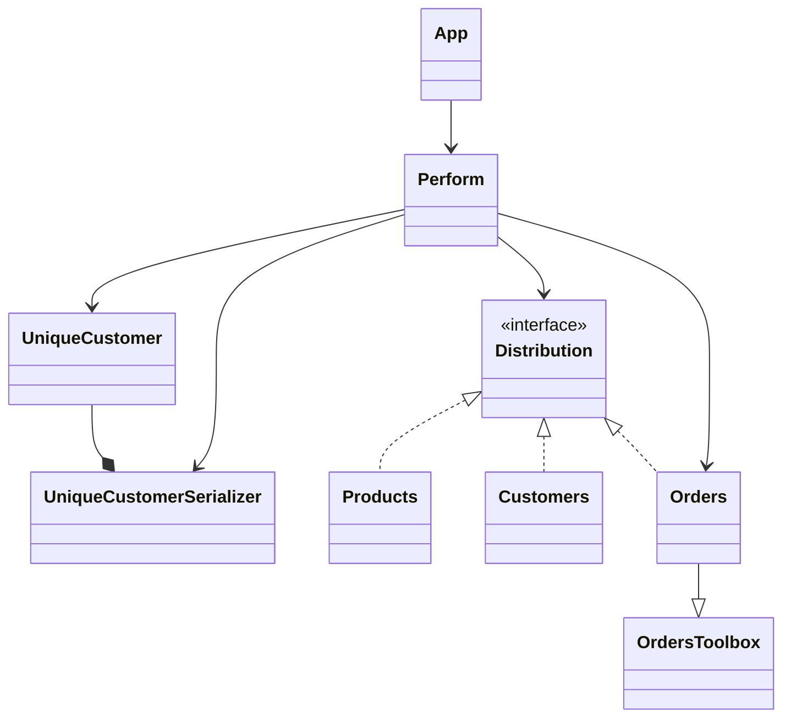
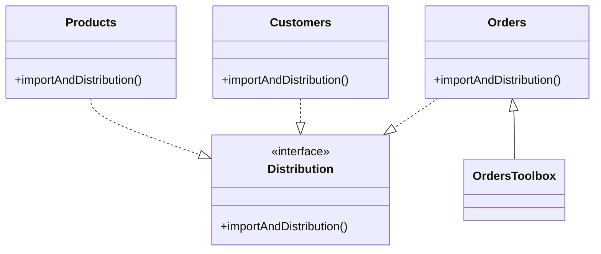
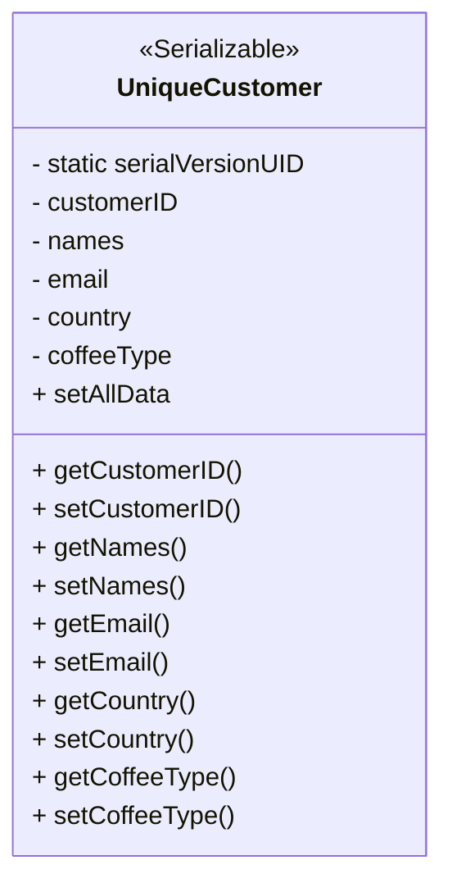
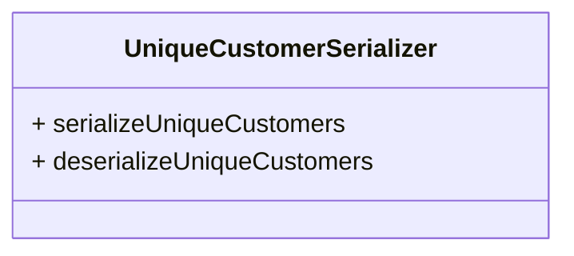
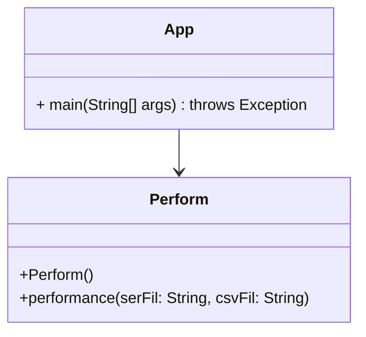

# Readme

## Inhalt

|  |  |
|--|--|
| [Ansatz](#ansatz) | [Hintergrund](#hintergrund) |
| [Klassendiagramm](#klassendiagramm) | [Datengewinnung](#datengewinnung) |
| [Serialisierungsprozess](#serialisierungsprozess) | [Ausgabe](#ausgabe) |
| [Tests](#tests) ||

---

## Ansatz
Data Scraping ist eine Technik, bei der ein Computerprogramm Daten aus der von Menschen lesbaren Ausgabe eines anderen Programms extrahiert.

Das nachfolgende Projekt arbeitet folgende Use Cases ab: 

**Usecase1 - Importieren und Verarbeiten von Kundendaten:**
Der Code liest Daten aus verschiedenen Tabellenblättern (*customers*,*orders*,*products*) und ordnet die relevanten Informationen zu. Dies ermöglicht die weitere Verarbeitung und Analyse von Kundendaten.

**Usecase2 - Erstellen von eindeutigen Kundenobjekten:**

Es wird eine Liste von Kunden-Objekten erstellt. Jedes Kunden-Objekt stellt einen eindeutigen Kunden dar und enthält Informationen wie Kunden-ID, Name, E-Mail und Land.

**Usecase3 - Serialisierung und Deserialisierung von Kundenobjekten:**

Die Kunden-Objekte werden in einer Datei (*serFile*) hinterlergt.

**Usecase4 - Exportieren von Kundendaten in eine CSV-Datei:**
Die Kundendaten werden in eine CSV-Datei(*ser_spread*) geschrieben. Jede Zeile enthält die Angaben zu einem Kunden. Dadurch können die Daten in Tabellenkalkulationsprogramme importiert oder weiter analysiert werden.

**Usecase5 - HTML-Ausgabe generieren:**
 Im Rahmen des generierten HTML-Dokuments (*output.html*) werden die Kundeninformationen in tabellarischer Form angezeigt. 

Sequenzdiagramm für die Use-Cases:

---

## Hintergrund

Das Scraping von Sheets ist aus mehreren Gründen wichtig.
Zum einen lassen sich große Datenmengen schnell erfassen, zum anderen lassen sich diese Daten dann mit Analysetools nutzen, um Erkenntnisse zu gewinnen. 
Darüber hinaus werden unstrukturierte Dateien in strukturierte Formate umgewandelt, wodurch sich Marktdaten, Preise von Mitbewerbern und andere wertvolle Informationen sammeln lassen, die für die Vorbereitung strategischer Entscheidungen von Nutzen sind.

---

## Klassendiagramm
Im Folgenden wird das vollständige Klassendiagramm präsentiert, welches im Rahmen des vorliegenden Projekts zum Einsatz kommt:

---

## Datengewinnung

Für die *generelle* Datengewinnung sind die Klassen *Customers, Orders, Products* und das Interface *Distribution* verantwortlich. Diese Klassen verfügen über die Methode *importAndDistribution()*.
Diese Methode ermöglicht den Import und die Verteilung der Daten mit Hilfe einer HashMap. Der Code liest CSV-Dateien zeilenweise ein und speichert die Daten in einer HashMap, wobei jeder Schlüssel ein Spaltenname und der Wert eine Liste der entsprechenden Daten ist. Die Methode ist mit *@override* gekennzeichnet, so dass das Interface *Distribution* darauf Zugriff hat. 

    
Klassendiagramm:
 

Für die *spezielle* Datengewinnung sind die Methoden in *OrdersToolbox* verantwortlich. Sie gleichen jeweils die ermittelten Daten der Klassen *Customers, Products und Orders* ab und haben die sprechenden Namen: *getMatchingCustomerName, getMatchingEmail, getMatchingCountry,  getMatchingCoffeeTypes*. 

---

## Serialisierungsprozess

Für den Serialisierungsprozess sind die Klassen *UniqueCustomer* und *UniqueCustomerSerializer* verantwortlich.
Mit *UniqueCustomer* können eindeutige Kunden-Objekte erstellt werden.
Jedes Kunden-Objekt stellt einen eindeutigen Kunden dar und enthält Informationen wie Kunden-ID, Name, E-Mail und Land.

Klassendiagramm *UniqueCustomer*: 

Der *UniqueCustomerSerializer* bietet die Möglichkeit, die Kundenobjekte in einer Datei (serFile) abzulegen, sodass sie zu einem späteren Zeitpunkt in einer CSV-Datei oder einem HTML-Dokument hinterlegt werden können. 

Klassendiagramm *UniqueCustomerSerializer*: 

---
## Ausgabe

Für das Generieren der CSV und HTML-Datei ist die  Klasse *Perform* zuständig. Ausgeführt wird eine Instanz von *Perform* in *App*.

Zuvor arbeitet die Methode *performance* folgende Schritte ab:

 1. Der Code importiert die erforderlichen Rohdaten mit der Methode *importAndDistribution()* des Interface *Distribution*. 
 2. Nun werden den Variablen Informationen aus den importierten Daten zugewiesen und in extra Listen gespeichert. So werden Kunden-IDs, Kundennamen, E-Mail-Adressen, Länder und Kaffeearten extrahiert.
 3. Für jeden Kunden wird ein eigenes *UniqueCustomer*-Objekt erstellt. Diese Objekte werden in einer Liste gespeichert.
 4. Das Programm verwendet die Klasse *UniqueCustomerSerializer*, um die Liste zu serialisieren.
 
 Für die CSV-Ausgabe wird
 
 5. ein *PrintWriter*-Objekt erstellt, um Daten in eine CSV-Datei zu schreiben, die über die Variable *csvFile* angegeben wird.
 6. die *UniqueCustomer*-Objekte werden durchlaufen, die durch die Datei *serFile* gewonnen wurden.
 7. Für jedes *UniqueCustomer*-Objekt werden Name, E-Mail, Land und Kaffeetyp auf der Konsole ausgegeben.
 8. Die Informationen werden mit der Methode *writer.println()* in die CSV-Datei geschrieben. 
 9. Zum Schluss wird "*Ready."* auf der Konsole angezeigt.
 
 Für die HTML-Ausgbabe wird
 
 10. ein weiteres *PrintWriter*-Objekt erstellt, um die Daten in eine HTML-Datei zu schreiben.
 11. Dann werden die HTML-Tags geschrieben.
 12. Jetzt wird eine HTML-Tabelle erstellt.
 13. Die Daten der *UniqueCustomer*-Objekte werden wie bei der CSV-Ausgabe durchlaufen und für jeden Kunden eine neue Zeile mit seinen Daten hinzugefügt.
 14. Wenn die Tabelle fertig ist, werden die HTML-Tags geschlossen.
 15.  Zum Schluss wird "*HTML document generated successfully"* auf der Konsole angezeigt.

Klassendiagramm *Perform* und *App*: 

---
## Tests
Im Ordner *Tests* sind für jede eingesetzte Klasse entsprechende JUnit-Tests hinterlegt. 
